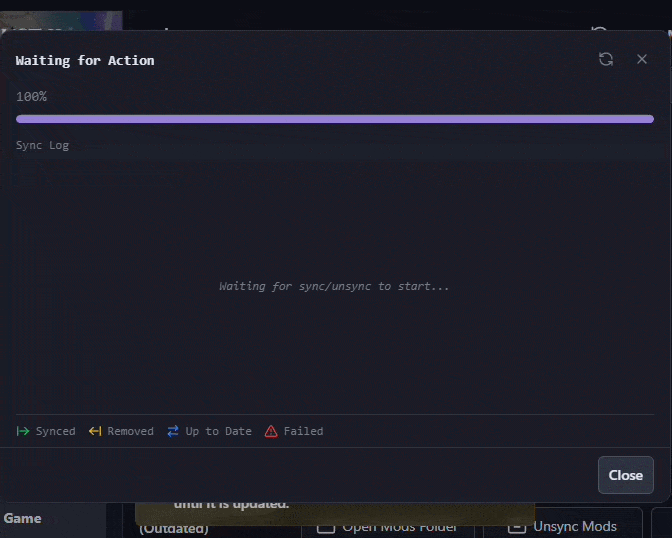
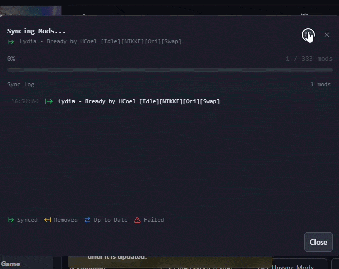
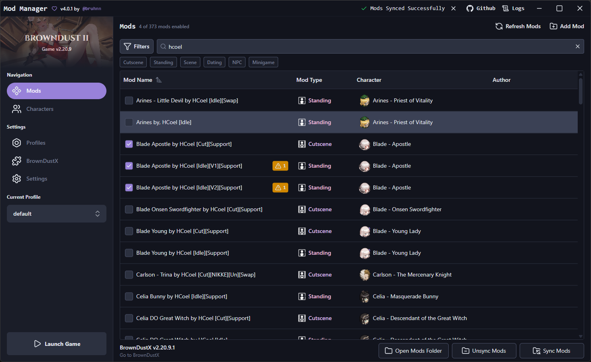
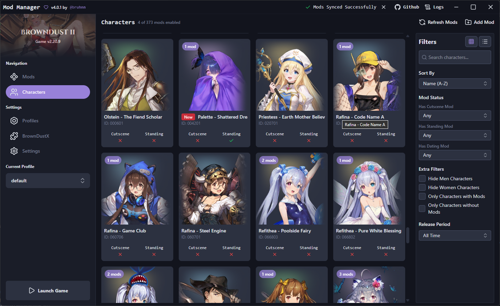
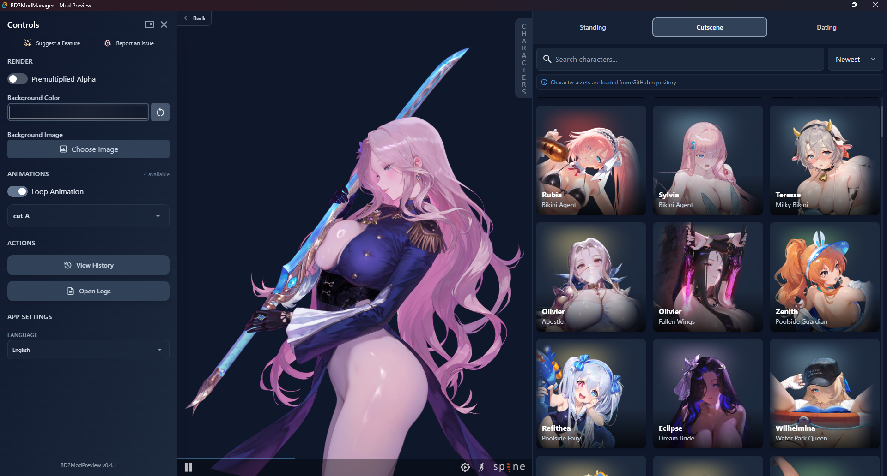

# Brown Dust 2 Mod Manager

[](https://github.com/bruhnn/BD2ModManager/blob/main/LICENSE)
[](https://github.com/bruhnn/BD2ModManager/releases)
[](https://github.com/bruhnn/BD2ModManager/releases)


> 🛠 Easily manage, preview, and sync mods for Brown Dust 2.
> 
> 🎉 **Download the latest version:** [GitHub Releases](https://github.com/bruhnn/BD2ModManager/releases/latest)
>

If you have suggestions or run into any problems with the app, feel free to open an issue or contact me.

> [!WARNING]
> **Before Uninstalling Brown Dust II !!!**
>
> If you use the **Symlink** sync method, unsync all mods before uninstalling the game. Otherwise, the uninstaller may delete your mods from the staging folder.

---

## 🛠️ How to Use
1. **Download** the app from [GitHub Releases](https://github.com/bruhnn/BD2ModManager/releases).
2. **Select your Brown Dust 2 directory** (where `BrownDust II.exe` is located)
   - Example: F:\Neowiz\Browndust2\Browndust2_10000001
3. **Install BepInEx and BrownDustX**
   - Download both from the BrownDustX Discord:
     [discord.gg/B3Aqz6tDG2](https://discord.gg/B3Aqz6tDG2)

   - Manual Steps:
        
      **Install BepInEx**
      
      Extract the contents of the BepInEx archive into the **game folder** (you can open the game folder from the mod manager)
      (**NOT** the launcher folder).
     
      Your folder should look like this:
      ```text
         Browndust2_10000001/
         ├─ BepInEx/
         ├─ winhttp.dll
         └─ BrownDust II.exe
      ```
  
      > The BepInEx archive from the BrownDustX Discord already includes ConfigurationManager.
   
      **Install BrownDustX**
     
      Extract the `BepInEx` folder from `BrownDustX-[VERSION].zip`
      into the same game folder.
     
      Your folder should look like this:
      ```text
         Browndust2_10000001/
         ├─ BepInEx/
         │  └─ plugins/
         │     └─ BrownDustX/
         └─ BrownDust II.exe
      ```
4. **Verify the installation**
   - Launch the game.
   - On the loading screen, the game version and BrownDustX version should appear in red at the top-right corner.
5. **Add your mods** by:
   - Moving them into the `mods/` folder  
     ⚠️ **Note:** This is *not* the BrownDustX `mods` directory. It's a separate folder used by this manager
6. **Enable or disable mods**.
7. **Sync your mods** to apply changes:
   - This will create a folder named `BD2MM` inside the `BrownDustX` mods folder with all your enabled mods.

> ⚠️ After making any changes (enable, disable, delete, rename), you **must sync** your mods to update the game folder.

### Sync Method: Copy vs Symlink

Choose how mods are synced to your BrownDust X `mods` folder:

#### 📁 Copy
Copies all enabled mods into the folder.  

- ✅ No admin rights needed
- ❌ Slower
- ❌ Uses more disk space

#### 🔗 Symlink  
Creates shortcuts instead of copying files.  

- ✅ Much faster
- ✅ Saves disk space
- ❌ Requires admin rights

#### Example Comparison (383 mods)

| Copy | Symlink |
|------|---------|
|  |  |

---

## 📸 Screenshots

### Mods Page (v4.0.1)


### Characters Page (v4.0.1)


### Mod Preview (BD2ModPreview)


---

## ❤️ Support the Project

If you enjoy the mod manager and want to support development, you can support me here:

- Ko-Fi: https://ko-fi.com/bruhnn
- 🇨🇳: https://afdian.com/a/bruhnn

---
## 🧰 Community & Related Projects  

- [**Brown Dust II Mod Manager (by kxdekxde)**](https://codeberg.org/kxdekxde/browndust2-mod-manager) – An alternative mod manager for Brown Dust 2
- [**BD2 Live2D Viewer (by jelosus2)**](https://jelosus2.github.io/BD2-L2D-Viewer) – Website to preview character animations
- [**BDroid_X (by Ark-Repoleved)**](https://github.com/Ark-Repoleved/BDroid_X) - Brown Dust II Mod Manager for Android

## ❓ FAQ

### Where can I get mods?
You can find mods on the BrownDustX Discord server: [https://discord.gg/B3Aqz6tDG2](https://discord.gg/B3Aqz6tDG2)

## 🤝 Credits & Thanks

- Character assets by [myssal/Brown-Dust-2-Asset](https://github.com/myssal/Brown-Dust-2-Asset)
- Thanks to **Synae** for *BrownDustX*
- Thanks to everyone who contributed by reporting bugs and suggesting features.  
   


## ✨ Star History

<a href="https://www.star-history.com/#bruhnn/BD2ModManager&Date">
 <picture>
   <source media="(prefers-color-scheme: dark)" srcset="https://api.star-history.com/svg?repos=bruhnn/BD2ModManager&type=Date&theme=dark" />
   <source media="(prefers-color-scheme: light)" srcset="https://api.star-history.com/svg?repos=bruhnn/BD2ModManager&type=Date" />
   
 </picture>
</a>
